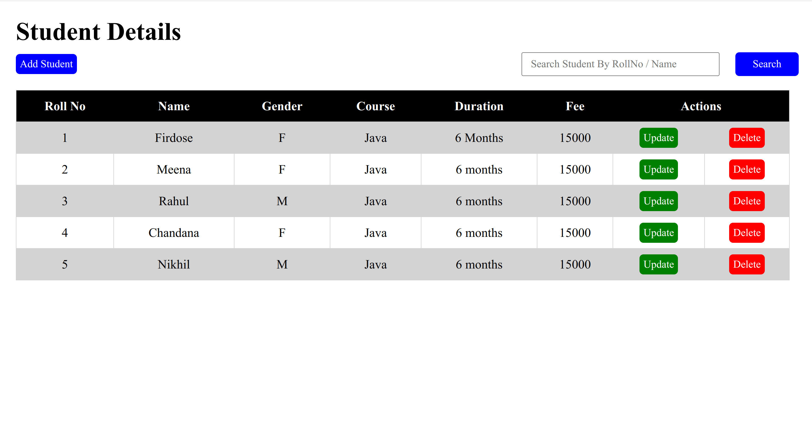
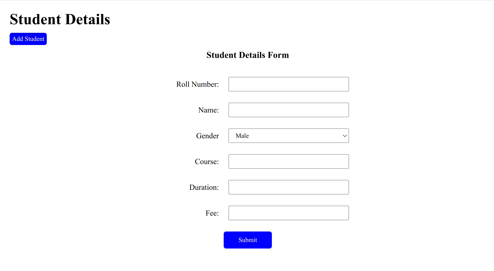
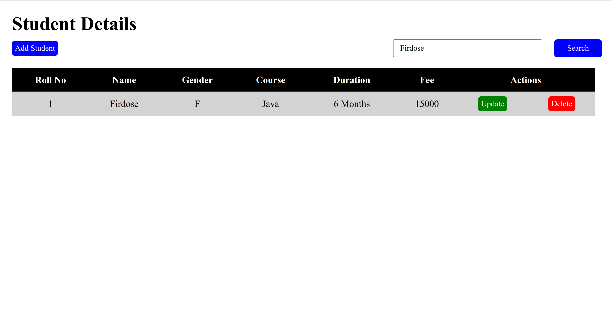

# Student Details CRUD Application

A full-stack web application for managing student details with complete CRUD (Create, Read, Update, Delete) operations using RESTful API services.

## 🌟 Features

- ✅ **Create** - Add new student records
- ✅ **Read** - View all students and individual student details
- ✅ **Update** - Edit existing student information
- ✅ **Delete** - Remove student records
- 🔍 **Search Functionality** - Search students by:
  - Roll Number
  - Student Name

## 🛠️ Technologies Used

### Frontend

- **HTML5** - Structure and markup
- **CSS3** - Styling and responsive design
- **JavaScript** - Interactivity and API communication

### Backend

- **Spring Boot** - REST API framework
- **Java** - Backend programming language
- **Maven** - Dependency management

### Database

- **MongoDB** - NoSQL database for data persistence

## 📁 Project Structure

```
StudentDetailsCRUD/
├── Frontend/
│   ├── index.html       # Main HTML page
│   ├── script.js        # JavaScript functionality
│   └── styles.css       # Stylesheet
├── Backend/
│   └── student/         # Spring Boot application
│       ├── src/
│       │   ├── main/
│       │   │   ├── java/com/mypro/student/
│       │   │   │   ├── StudentApplication.java
│       │   │   │   ├── controller/
│       │   │   │   ├── model/
│       │   │   │   ├── repository/
│       │   │   │   └── service/
│       │   │   └── resources/
│       │   │       └── application.properties
│       │   └── test/
│       └── pom.xml
├── images/              # Screenshots and demo images
└── README.md            # This file
```

## 📸 Application Screenshots

### 1. Students List View


_View all students with their complete details in a table format._

### 2. Add and Update Form


_Form for adding new students and updating existing student information._

### 3. Search by Roll Number


_Search functionality to find students by their roll number._

### 4. Search by Name


_Search functionality to find students by their name._

## 🚀 Getting Started

### Prerequisites

- Java 8 or higher
- Maven 3.6 or higher
- MongoDB installed and running
- Modern web browser

### Backend Setup

1. **Navigate to the Backend directory**

   ```bash
   cd Backend/student
   ```

2. **Configure MongoDB connection**

   - Open `src/main/resources/application.properties`
   - Update MongoDB connection details if needed

3. **Build the project**

   ```bash
   mvn clean install
   ```

4. **Run the Spring Boot application**
   ```bash
   mvn spring-boot:run
   ```
   The backend API will be available at `http://localhost:8080`

### Frontend Setup

1. **Navigate to the Frontend directory**

   ```bash
   cd FrontEnd
   ```

2. **Open the application**

   - Open `index.html` in your web browser
   - Or use a local server (recommended):

   ```bash
   # Using Python 3
   python -m http.server 8000

   # Or using Node.js (with http-server)
   npx http-server
   ```

## 📋 API Endpoints

### Base URL

```
http://localhost:8080/student
```

### Available Endpoints

| Method | Endpoint                    | Description                   |
| ------ | --------------------------- | ----------------------------- |
| POST   | `/insert`                   | Create/Insert new student     |
| GET    | `/allStudents`              | Get all students              |
| GET    | `/findStudentById/{rollNo}` | Get student by roll number    |
| GET    | `/findStudentByName/{name}` | Search students by name       |
| PUT    | `/update`                   | Update student information    |
| DELETE | `/delete/{rollNo}`          | Delete student by roll number |

## 💻 Usage

1. **View All Students**

   - Open the application in your browser
   - The student list will load automatically

2. **Add New Student**

   - Click the "Add Student" button
   - Fill in the student details
   - Click "Submit" to save

3. **Update Student**

   - Click the "Edit" button on any student
   - Modify the student details
   - Click "Update" to save changes

4. **Delete Student**

   - Click the "Delete" button on any student
   - Confirm the deletion

5. **Search Students**
   - Use the search bar at the top
   - Search by Roll Number or Name
   - Results will display matching students

## 🔧 Configuration

### MongoDB Connection (Backend)

Update `application.properties` with your MongoDB connection details:

```properties
spring.data.mongodb.uri=mongodb://localhost:27017/student_db
```

### CORS Configuration

If running Frontend and Backend on different origins, ensure CORS is properly configured in the Spring Boot application.

## 📝 Model Schema

### Student Model

```java
@Id
private Integer rollNo;        // Unique identifier
private String name;           // Student's full name
private char gender;           // Gender (M/F/O)
private String course;         // Course name
private String duration;       // Course duration
private int fee;               // Course fee amount
```

## 🤝 Contributing

Contributions are welcome! Feel free to:

- Report bugs
- Suggest new features
- Submit pull requests

## 📄 License

This project is open source and available under the MIT License.

## 👨‍💻 Author

ReddiRani8496

## 📞 Contact & Support

For any issues or questions, please open an issue in the GitHub repository.

---

**Happy Coding!** 🎉
